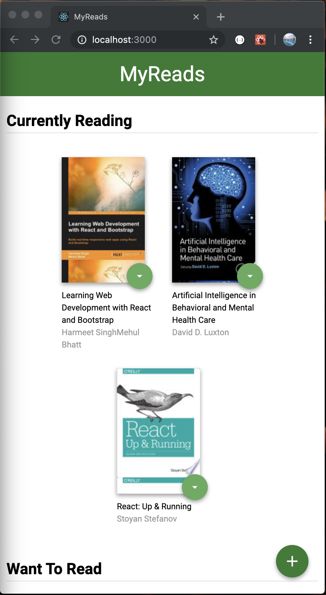
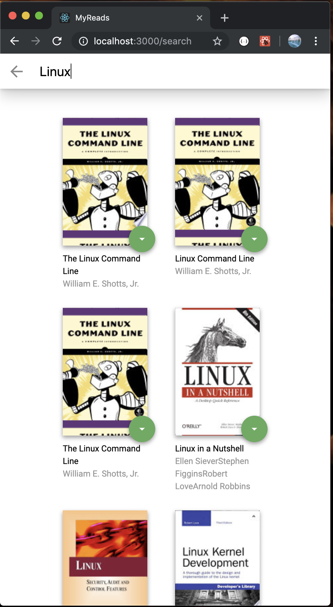

# MyReads

The app allows users to select and categorize books they have read, are currently reading, or want to read. Each book has a control that lets users select the shelf for that book. When users select a different shelf, the book moves there.

The main page displays a list of "shelves" (i.e. categories), each of which contains a number of books. The three shelves are:

* Currently Reading
* Want to Read
* Read

The main page also has a link to /search, a search page that allows users to find books to add to their library. The search page has a text input box which is used to find books. As the value of the text input changes, the books that match that query are displayed on the page, along with a control that lets users add a book to your library. 

## Technology Used

This app is developed using React, HTML, CSS, JavaScript and JSX.

## Run

To run the app:

* install all project dependencies with `npm install`
* start the development server with `npm start`

## API

The app consumes the REST API at [`https://reactnd-books-api.udacity.com`]

